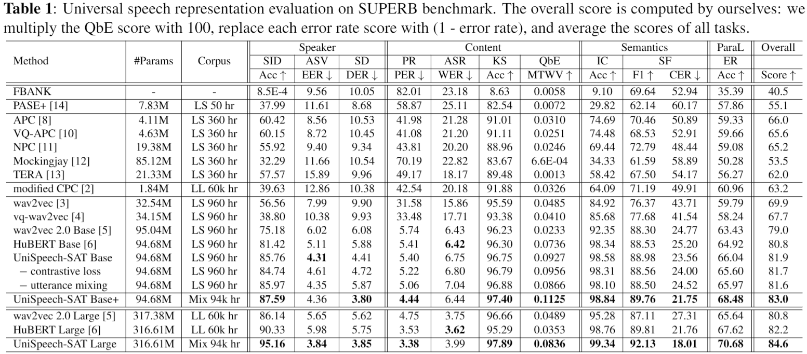

# UniSpeech-SAT

> [**UniSpeech-SAT**](https://arxiv.org/pdf/2110.05752.pdf) (```ICASSP 2022 Submission```): **Universal Speech Representation Learning with  Speaker Aware Pre-Training**

## Universal Representation Evaluation on SUPERB 


## Downstream Task Performance 
We also evaluate our models on typical speaker related benchmarks.
### Speaker Verification
| Model         |Fix pre-train| Vox1-O | Vox1-E     | Vox1-H         |
| ------------- |------------- | ---------- | ---------- | ---------- |
| ECAPA-TDNN   | - | 0.87     | 1.12  | 2.12   |
| HuBERT large  | Yes|  0.888	|0.912|	1.853 |
| Wav2Vec2.0 (XLSR)| Yes | 0.915|	0.945	|1.895|
| UniSpeech-SAT large | Yes | 0.771	| 0.781|	1.669|
| HuBERT large | No| 0.585|	0.654	|1.342|   
| Wav2Vec2.0 (XLSR) | No| **0.564**|	0.605	|**1.23**|   
| **UniSpeech-SAT large** | No | **0.564** | **0.561** | **1.23** |

[Our paper for verification](https://arxiv.org/pdf/2110.05777.pdf)


### Speech Separation

Evaluation on [LibriCSS](https://github.com/chenzhuo1011/libri_css)

| Model         |0S | 0L | OV10     |      OV20     |OV30 |OV40 |
| ---------------- |------| ------ | ------ | ------ | ------ | ------ |
| [Conformer](https://ieeexplore.ieee.org/abstract/document/9413423/) (SOTA)   | 4.5	| 4.4	|6.2	|8.5|	11	|12.6|
| HuBERT base | 4.7|	4.6	| 6.1 | 7.9|	10.6|	12.3|
| UniSpeech-SAT base+ | 4.4|	4.4	|5.4|	7.2|	9.2	|10.5|
| **UniSpeech-SAT large** | **4.3**|	**4.2**	|**5.0**	|**6.3**|	**8.2**|	**8.8**|


### Speaker Diarization

Evaluation on CALLHOME

| Model         |spk_2	|spk_3|	spk_4|	spk_5|	spk_6|	spk_all |
| ---------------- |------| ------ | ------ | ------ | ------ | ------ |
| [EEND-vector clustering](https://arxiv.org/pdf/2105.09040.pdf)   | 7.96|	11.93	|16.38|	21.21|	23.1	|12.49||
| [EEND-EDA clustering](https://arxiv.org/abs/2107.01545) (SOTA)  | 7.11|	11.88 |14.37|	25.95|	21.95	|11.84||
| HuBERT base| 7.93|12.07|	15.21	|19.59|	23.32|	12.63|
| HuBERT large| 7.39|	11.97|	15.76	|19.82|	22.10|	12.40|
| **UniSpeech-SAT large** | **5.93**|	**10.66**|	**12.9**	|**16.48**|	**23.25**|	**10.92**|


## License
This project is licensed under the license found in the LICENSE file in the root directory of this source tree.
Portions of the source code are based on the [FAIRSEQ](https://github.com/pytorch/fairseq) project.

[Microsoft Open Source Code of Conduct](https://opensource.microsoft.com/codeofconduct)


### Reference
If you find our work is useful in your research, please cite the following paper:

``` latex
@article{Chen2021UniSpeechSAT,
  title   = {UniSpeech-SAT: Universal Speech Representation Learning with  Speaker Aware Pre-Training},
  author  = {Sanyuan Chen and Yu Wu and Chengyi Wang and Zhengyang Chen and Zhuo Chen and Shujie Liu and   Jian Wu and Yao Qian and Furu Wei and Jinyu Li and  Xiangzhan Yu},
  eprint={2110.05752},
  archivePrefix={arXiv},
  primaryClass={cs.CL},
  year={2021}
}
```


### Contact Information

For help or issues using UniSpeech models, please submit a GitHub issue.

For other communications related to UniSpeech, please contact Yu Wu (`yuwu1@microsoft.com`).
